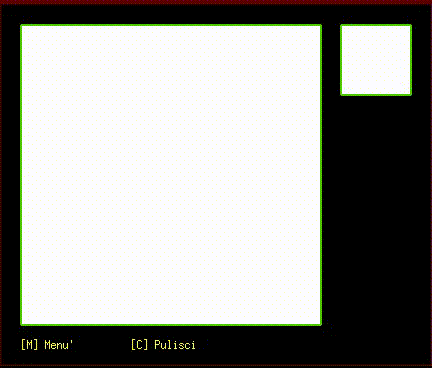
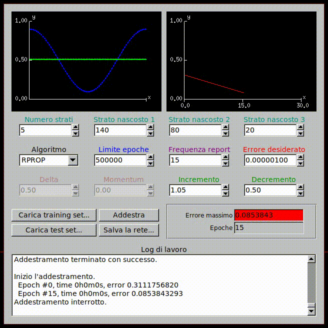

# 2010 - Serotonina Neural Network Library (memories from my past)

My high school graduation project (before Machine Learning was a real thing). The project includes a handwriting recognition tool and a trainer with UI.

Full thesis at [Le Reti Neurali Artificiali](http://www.hackyourmind.org/public/files/Le%20reti%20neurali%20artificiali%20-%20tesi%20di%20maturita.pdf).





## Supported training algorithms

+ BATCH (Delta Rule + Momentum)
+ RPROP
+ RPROP+
+ RPROP-
+ IRPROP+
+ IRPROP-

## Building with CMake

```
$ cd <SOURCES>
$ cmake ./ -DCMAKE_INSTALL_PREFIX=<PATH>
$ make
$ make doc_{en|it} (`make doc_en` for english documentation)
# make install
```

## Dependencies

Serotonina has no dependencies (this bitch still compile after more than 9 years!).

Only for demos:

 + OpenGL;
 + FLTK 1.3 - <http://www.fltk.org/>;
 + OpenCV (only libhighgui) - <http://opencv.willowgarage.com/>;
 + pthread - <http://sourceware.org/pthreads-win32/>
